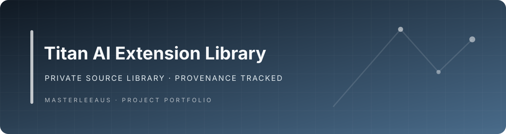

# Titan AI Extension Library

Deep-scanned and losslessly extracted AI extension library from `Extensions(2).zip`, with the verified TitanAI Hybrid Pass 3 core suites applied as a reproducible overlay.

## Repository scope

- **78 selected AI extensions**
- **4,213 source and asset files** in `extensions/`
- **81,372,739 raw extension bytes**
- Core suites: **AIChatPro**, **Chatbot**, and **AIAgent**
- Canonical chatbot: **Chatbot 7.0.0-five-application-registry**
- Shared Composer foundation: `packages/titanai-hybrid-core/` (`titanai/hybrid-core:1.0.0`)

## Materialisation

The base extraction is stored as a lossless MiniUp Parquet transport dataset. Each row preserves the original path, file bytes compressed with zlib and base64, raw byte count, category and SHA-256 checksum.

A second verified MiniUp transport dataset contains the TitanAI Hybrid Pass 3 replacements for `AIAgent`, `AIChatPro` and `Chatbot`, plus the original shared foundation source. The GitHub Actions workflow restores that verified source, deterministically converts the foundation into `packages/titanai-hybrid-core`, updates the three shared integrations, validates the package, regenerates inventories and commits the result.

This two-layer process preserves the other 75 extensions unchanged and prevents future materialisation runs from reverting the upgraded core suites.

## Documentation

- [`docs/TITANAI-COMPOSER-PACKAGE.md`](docs/TITANAI-COMPOSER-PACKAGE.md) — package layout, WorkCore installation, compatibility and versioning.
- [`docs/CORE-SUITES-PASS3-REPLACEMENT.md`](docs/CORE-SUITES-PASS3-REPLACEMENT.md) — current replacement scan, measured structure, architecture and verification.
- [`docs/CORE-SUITES-DEEP-SCAN.md`](docs/CORE-SUITES-DEEP-SCAN.md) — original architecture and capability analysis of AIChatPro, Chatbot and AIAgent.
- [`docs/EXTENSION-CATALOG.md`](docs/EXTENSION-CATALOG.md) — features, routes, data models, dependencies, external services and public functions for all 78 selected extensions.
- [`docs/ARCHITECTURE-RISKS-AND-RECOMMENDATIONS.md`](docs/ARCHITECTURE-RISKS-AND-RECOMMENDATIONS.md) — overlap, technical risks, extraction decisions and recommended consolidation.
- [`docs/extension-inventory.csv`](docs/extension-inventory.csv) — compact machine-readable inventory.
- [`docs/extension-inventory.json`](docs/extension-inventory.json) — detailed machine-readable inventory.

## Categories

- **AIChatPro and chat workspace:** 16 extensions
- **Chatbot and customer conversation runtime:** 9 extensions
- **Autonomous agents and workflow automation:** 10 extensions
- **Model providers and model orchestration:** 10 extensions
- **Creative, image, audio and video AI:** 26 extensions
- **Content, SEO, social and growth AI:** 6 extensions
- **Business discovery and intelligence:** 1 extension

## Installation model

These are MagicAI/Laravel marketplace extensions. Keep each extension folder name unchanged when copying it into the host extension directory. Install `titanai/hybrid-core:^1.0` in the WorkCore host before enabling the upgraded core suites, then install each core extension before its add-ons and run the host migration and publish process in a controlled environment.

Do not enable every package simultaneously without resolving the duplicated authority boundaries described in the architecture reports.
